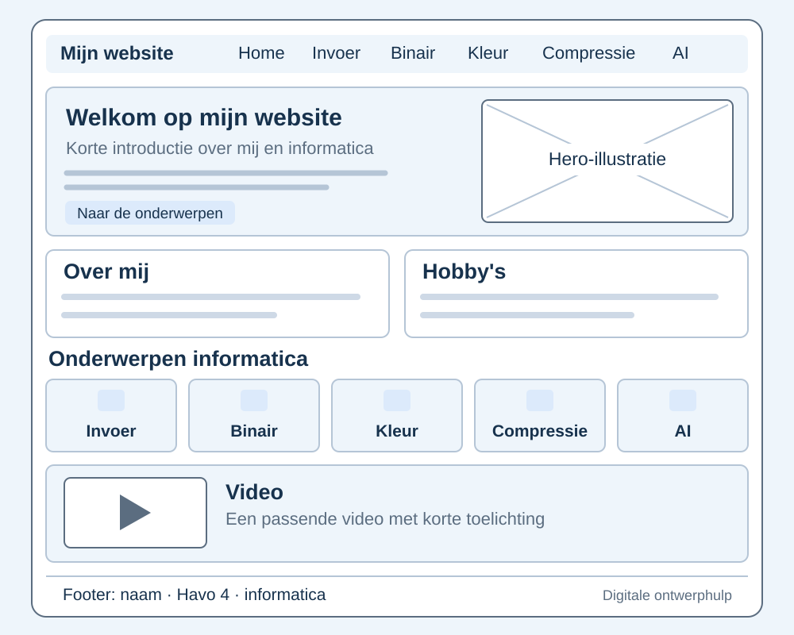

# Ontwerp van mijn informaticawebsite

**Gido · Havo 4B · Informatica**

Dit is een concept, afgestemd op de huidige website. Controleer zelf of je alles begrijpt. Vul je eigen meningen, tekening en persoonlijke AI-ervaring aan voordat je dit document inlevert.

## 1. Doel en inhoud

De website is bedoeld voor mijn informaticaopdracht over Domein C. Bezoekers moeten de onderwerpen makkelijk kunnen vinden en begrijpen. Mijn hobby’s zijn gamen en series kijken. Daarom passen een gamevoorbeeld bij invoer en uitvoer en een streamingvoorbeeld bij compressie goed bij de site.

Het hoofdmenu heeft zes pagina’s:

| Pagina | Inhoud |
| --- | --- |
| Home — `index.html` | Gido, Havo 4B, gamen, series kijken en links naar de onderwerpen. |
| Invoer & uitvoer — `invoer.html` | Invoer, verwerking, uitvoer, CPU en RAM, met een gamevoorbeeld. |
| Binair — `binair.html` | Bits, bytes, binaire getallen, hexadecimaal, een oefening en Binary Bonanza. |
| Kleurmodellen — `kleurmodellen.html` | RGB, CMYK, kleurcodes en een interactieve RGB-mixer. |
| Compressie — `compressie.html` | Bitmap, vector, lossy, lossless, geluid en bestandsgrootte. |
| AI — `ai.html` | Wat AI is, controleren van antwoorden, mijn nog aan te vullen ervaring en Gemini op mijn Google Pixel. |

De bestaande spelletjespagina blijft bereikbaar via een extra kaart op Home.

## 2. Drie mooie en drie minder mooie websites

**Voorstellen: controleer zelf of dit jouw mening is en vervang ze door je eigen gekozen sites.** Je had al websites gekozen, maar hun namen zijn nog niet doorgegeven. Hieronder staan alleen voorbeeldargumenten die je bij een bezoek kunt toetsen. Deze websites zijn hier niet live bekeken. De beoordeling is persoonlijk; een druk of ouder ontwerp kan ook bewust gekozen zijn.

| Voorstel | URL | Mogelijk argument na eigen bezoek |
| --- | --- | --- |
| Mooi: Apple | https://www.apple.com/ | Grote beelden, korte teksten en veel witruimte kunnen zorgen voor een rustige indeling. |
| Mooi: Wikipedia | https://www.wikipedia.org/ | Een duidelijk startpunt en herkenbare zoekfunctie kunnen helpen om snel informatie te vinden. |
| Mooi: NASA | https://www.nasa.gov/ | Ruimtefoto’s en duidelijke koppen kunnen goed passen bij de inhoud. |
| Minder mooi: Arngren | https://www.arngren.net/ | Veel kleine onderdelen dicht bij elkaar kunnen het moeilijk maken om te kiezen waar je kijkt. |
| Minder mooi: LingsCars | https://www.lingscars.com/ | Een bewust opvallende of drukke stijl kan afleiden van de informatie die je zoekt. |
| Minder mooi: Space Jam uit 1996 | https://www.spacejam.com/1996/ | De oude stijl kan gedateerd ogen en minder aansluiten bij hoe ik nu een menu en pagina verwacht. |

Voor mijn eigen ontwerp neem ik vooral overzicht, korte tekstblokken en voldoende ruimte als uitgangspunt.

## 3. Indeling en schets

Bovenaan staat de naam Gido met daarnaast het menu. Daaronder staan een grote titel en korte introductie links en een illustratie rechts. De homepage heeft daarna blokken over school en hobby’s, kaarten naar de onderwerpen, een video met toelichting en een voettekst. De onderwerpkaarten staan op een breed scherm in drie kolommen. Op een telefoon komen de onderdelen onder elkaar.

De afbeelding is een digitale ontwerphulp en geeft een globale indeling. Het is geen eigen papieren tekening en vervangt die opdracht niet. De huidige homepage gebruikt drie persoonlijke kaarten en meerdere onderwerpkaarten; de schets is een vereenvoudiging. Maak zelf een papieren schets van de pagina, geef menu, tekst en afbeeldingen aan en voeg een foto of scan van je tekening aan dit document toe.

## 4. Kleuren, letters en ruimte

| Onderdeel | Kleur in de CSS | Reden |
| --- | --- | --- |
| Achtergrond | `#f6f8fb` | Een heel lichte achtergrond maakt de witte kaarten zichtbaar. |
| Kaarten en menubalk | `#ffffff` | Wit houdt de pagina rustig. |
| Hoofdtekst en koppen | `#17324d` | Donkerblauw is duidelijk leesbaar op de lichte achtergrond. |
| Knoppen en links | `#2458c4` | Blauw laat zien waar je kunt klikken. |
| Lichte accenten | `#eef5fb` | Lichtblauw verbindt het menu, voorbeelden en uitlegblokken. |

Het lettertype is Arial, met een algemeen schreefloos lettertype als reserve. De gewone tekst is 17 pixels en heeft een regelafstand van 1,7. Koppen zijn groter. Korte alinea’s en ruimte tussen de kaarten maken het lezen makkelijker. De inhoud heeft een maximale breedte van 1120 pixels, zodat de tekst op een groot scherm niet te ver uitloopt.

## 5. Menu en knoppen

Hetzelfde menu staat op iedere pagina. De huidige pagina krijgt een lichtblauw vlak, zodat je ziet waar je bent. De homepage heeft een blauwe knop naar de onderwerpen en een witte knop naar ‘Over mij’. Kaarten hebben duidelijke tekstlinks. De bitknoppen wisselen tussen nul en één. De RGB-schuifbalken veranderen een kleurvoorbeeld. Bij toetsenbordbediening krijgt het geselecteerde onderdeel een zichtbare rand.

## 6. Afbeeldingen en video’s

De website gebruikt SVG-illustraties: die blijven scherp bij vergroten. Elke hoofdafbeelding heeft een `alt`-tekst. Een gewone link heeft `href`; een afbeelding heeft `src`. Een link om een afbeelding heen maakt de afbeelding klikbaar, bijvoorbeeld bij Binary Bonanza.

Bij elke pagina staat een voorgestelde Code.org-video met een reden voor de keuze. De video wordt ingesloten met een `iframe`; daarnaast staat een link naar YouTube. Dit betekent niet dat de video’s al bekeken zijn. Bekijk ze zelf en controleer de redenen en de samenvatting bij compressie.

| Pagina | Gekozen video | Link |
| --- | --- | --- |
| Home | What Makes a Computer, a Computer? | https://www.youtube.com/watch?v=mCq8-xTH7jA |
| Invoer & uitvoer | Memory, CPU, Input, & Output | https://www.youtube.com/watch?v=DKGZlaPlVLY |
| Binair | Binary & Data | https://www.youtube.com/watch?v=USCBCmwMCDA |
| Kleurmodellen | Images, Pixels and RGB | https://www.youtube.com/watch?v=15aqFQQVBWU |
| Compressie | Text compression widget | https://www.youtube.com/watch?v=LCGkcn1f-ms |
| AI | Introduction to Large Language Models | https://www.youtube.com/watch?v=6NDEoJ4gWtM |

## 7. Code en publicatie

HTML geeft de inhoud en structuur. `stylesheet.css` regelt kleuren, letters en indeling. `script.js` regelt de binaire oefening en de RGB-mixer. De uitleg blijft ook leesbaar zonder JavaScript. Opmerkingen in de code leggen belangrijke onderdelen uit.

De repository met de code is: https://github.com/gidosluiter/gidosluiter.github.io

De website-URL is: https://gidosluiter.github.io/

Controleer vóór het inleveren of de nieuwe versie online staat en of de links werken. De online versie kan nog oud zijn. De zes pagina’s zijn lokaal op verschillende schermbreedtes gecontroleerd. De binaire oefening en RGB-mixer zijn met muis en toetsenbord getest. Het afspelen van externe video’s is nog niet getest.

## 8. Nog zelf doen

- Voeg in `ai.html` jouw concrete AI-gebruik toe: waarvoor gebruikte je AI en wat heb je geleerd? Vul dezelfde ervaring in bij het AI-deel van het videoscript.
- Gebruik je eigen zes websites en meningen. Controleer de voorstellen en maak zelf de vereiste papieren ontwerpschets. Voeg een foto of scan van jouw tekening toe aan het ontwerpdocument.
- Bekijk alle zes gekozen Code.org-video’s. Controleer of ze passen en pas de redenen en samenvattingen aan na het kijken, vooral de uitleg bij compressie.
- Speel een paar levels van Binary Bonanza en controleer of je de binaire voorbeelden zelf kunt uitleggen.
- Eigen foto’s zijn optioneel; je kunt de huidige illustraties later vervangen door passende foto’s die je mag gebruiken.
- Oefen de rondleiding, neem een schermvideo van maximaal vijf minuten op en lever de video volgens de opdracht in. Er is nog geen opname gemaakt.
- Controleer vóór het inleveren of de nieuwe versie online staat en of de links werken.
